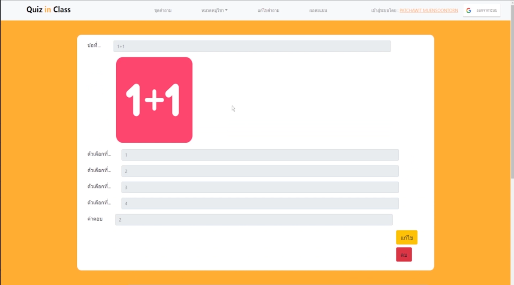

## Quiz in Class
* Quiz In Class เป็นระบบตอบคำถามโดยที่ให้ผู้สอนเปิดชุดคำถามผ่านระบบและให้ผู้เรียนเข้ามาตอบคำถามผ่านการสแกน QrCodeหรือกดLinkเพื่อเข้ามาตอบคำถามในระบบของผู้สอนโดยระบบนี้ผู้สอนสามารถสร้างคำถามขึ้นมาทันทีระหว่างสอนหรือใช้คำถามที่บันทึกไว้ในระบบแล้วก็ได้ วิธีนี้จะทำให้ผู้เรียนหันกลับมาสนใจบทเรียนและช่วยเสริมสร้างปฏิสัมพันธ์ระหว่างผู้สอนและผู้เรียนอีกทั้งผู้สอนยังสามารถนำระบบนี้ใช้ในการวัดผลคะแนนได้
## Built With 
* <a href="https://en.wikipedia.org/wiki/React_(JavaScript_library)" target="_blank">React</a>
* <a href="https://en.wikipedia.org/wiki/Node.js" target="_blank">Node.js</a>
* <a href="https://en.wikipedia.org/wiki/MongoDB" target="_blank">MongoDB</a>
* <a href="https://en.wikipedia.org/wiki/HTML" target="_blank">HTML</a> <a href="https://en.wikipedia.org/wiki/Cascading_Style_Sheets" target="_blank">CSS</a> <a href="https://en.wikipedia.org/wiki/JavaScript" target="_blank">JavaScript</a> 

## Interface

## Group Members
 |||
 |:---:|:---:|
|[Narawich](https://github.com/Narawich)|[Patchawit](https://github.com/Patchawit)|
